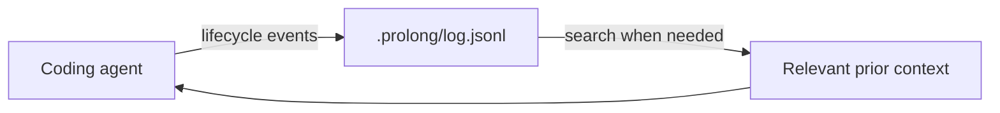

# PRO-LONG

<p align="center">
  <a href="https://arxiv.org/abs/2607.20064">
    
  </a>
  <a href="LICENSE">
    
  </a>
  <a href="#client-support">
    
  </a>
</p>

**Durable memory for coding agents.**

Long tasks outlive context windows. After compaction or a fresh session, coding
agents can lose earlier decisions, repeat failed work, and miss important tool
results.

PRO-LONG records coding-session events in one local, append-only log and gives
the agent a skill for searching only the history it needs. You keep using your
normal coding CLI—there is no wrapper, server, database, or transcript dumped
into the prompt.

Works with **Codex, Claude Code, OpenCode, and pi**.

## Updates

- **August 19, 2026** — Added PRO-LONG memory for coding CLIs, with
  project-local integrations for Codex, Claude Code, OpenCode, and pi.

## Quick start

Install PRO-LONG, then initialize it inside your project:

```bash
git clone https://github.com/alexisfox7/PRO-LONG.git && cd PRO-LONG
npm install && npm run build && npm link

cd /path/to/your/project
prolong init
```

Then use your coding agent normally. PRO-LONG records in the background and the
agent retrieves relevant history when a task spans compaction or sessions.

## How it works



1. `prolong init` installs a small project-local adapter and the `prolong`
   agent skill.
2. The adapter appends prompts, tool activity, assistant handoffs, and session
   boundaries to `.prolong/log.jsonl`.
3. When prior work matters, the skill teaches the agent to search the log with
   ordinary tools such as `rg`, `jq`, or Python and read only the relevant
   entries.

PRO-LONG does **not** inject the accumulated log into every prompt. Reads of the
log are also excluded from recording, so retrieval cannot recursively copy the
memory back into itself.

## Commands

The complete CLI has three commands:

```bash
prolong init
prolong status
prolong uninstall
```

- `init` detects supported coding clients on `PATH`.
- `status` checks the skill, runtime, and client integrations. Use
  `status --json` for automation.
- `uninstall` removes the integration but preserves the log. Add `--purge` to
  delete the recorded history too.

To select clients explicitly:

```bash
prolong init --client codex,claude-code,opencode,pi
```

## Client support

| Client | Project integration |
|---|---|
| Codex | `.codex/hooks.json` lifecycle hooks |
| Claude Code | `.claude/settings.json` lifecycle hooks |
| OpenCode | `.opencode/plugins/prolong.ts` plugin |
| pi | `.pi/extensions/prolong.ts` extension |

Hooks and extensions run with your user permissions. Review the generated
integration and accept the client's project or hook trust prompt before use.

<details>
<summary>Files installed by <code>prolong init</code></summary>

- `.prolong/runtime.mjs`: dependency-free event writer
- `.prolong/log.jsonl`: local append-only session history
- `.prolong/install.json`: installation manifest used by status and uninstall
- `.agents/skills/prolong/SKILL.md`: shared agent retrieval skill
- `AGENTS.md`: small managed pointer to the memory log
- the selected client hooks, plugin, or extension
- a managed `.prolong/` entry in `.gitignore`

Claude Code also receives a small managed pointer in `CLAUDE.md`.

</details>

## Privacy

The log stays inside the project and is gitignored by default. It can contain
prompts, assistant messages, tool inputs, tool results, and any secrets that
appeared in them. Do not enable transcript retention where local policy forbids
it. Run `prolong uninstall --purge` when the history should be removed.

## Research foundation

PRO-LONG began as research on programmatic memory for long-horizon agents. On
the full ARC-AGI-3 public game set, the research harness improved over matched
coding-agent baselines by 18 percentage points on average and reached 97.4%
best@2 with Fable 5. These results motivate the product design; they are not yet
a direct benchmark of the coding-tool MVP.


*The original PRO-LONG context framework evaluated on ARC-AGI-3.*

- [Paper: *PRO-LONG: Programmatic Memory Enables Long-Horizon Reasoning*](https://arxiv.org/abs/2607.20064)
- [ARC-AGI-3 reproduction code and logs](research/arc-agi-3/README.md)
- [Citation metadata](CITATION.cff)

## License

[MIT](LICENSE)
